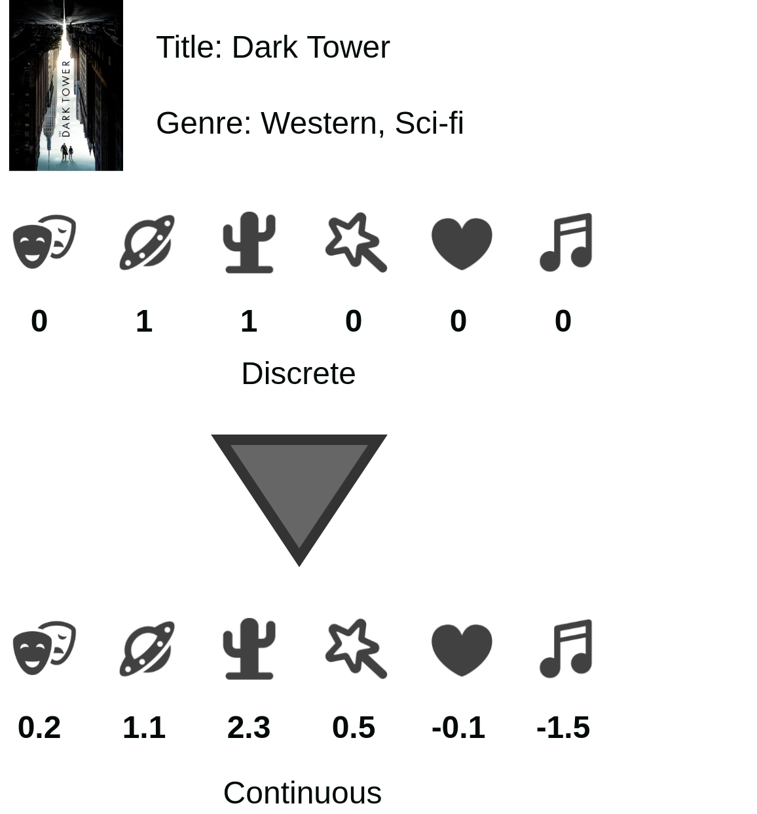
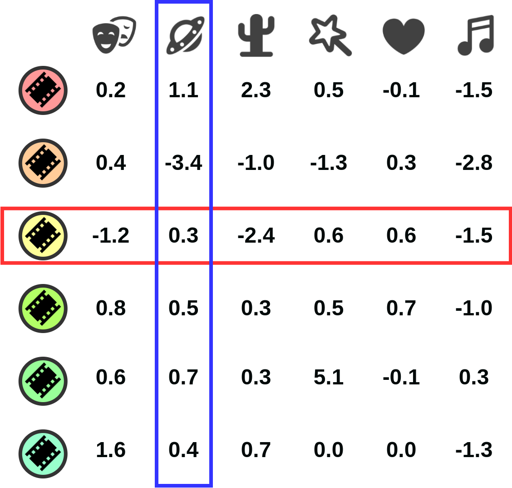
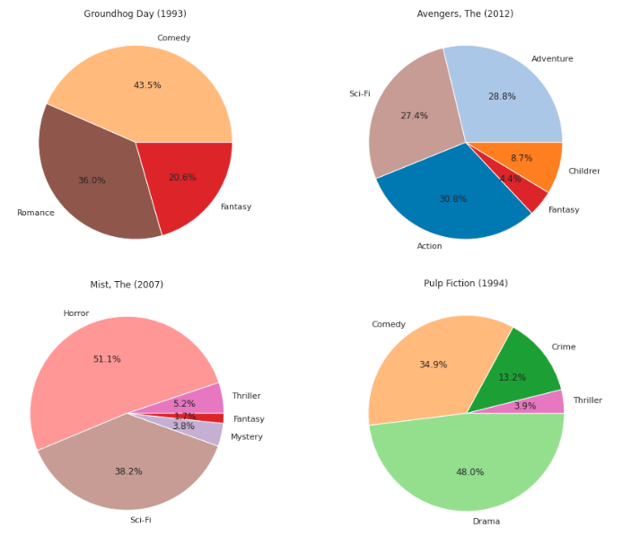

# Movie-Genre Analysis with Topic-Specific Pagerank


The project shows how to calculate continuous genre scores for movies by using ideas similar to Topic-Specific Pagerank and Trustrank from a rating dataset (movielens-25m).
It was my course project for graduate level Dynamic and Social Network Analysis course in Bilkent University. 

For more information about the approach, you can read [this blog post](https://seljuk.me/movie-genre-analysis-with-topic-specific-pagerank.html).

## Introduction


The standard representation of movie genres is categorical.
When we view a movie's information, we see something like Western, Sci-fi.
For each genre, the film either contains that genre or not.
Can we convert this categorical representation into a continuous vector?
Instead of saying exist or not exist for a genre, can we assign a real number that shows the effect of that genre for a particular movie?




The figure below shows one benefit of computing continuous score vectors for each genre. Each row in the figure shows genre scores of a movie, and each column shows scores of the movies for a genre. It allows us to compare different genre scores of a movie (What is the dominant genre of this movie?) and compare different films for a particular genre (Is movie A or movie B more sci-fi movie?).



## Setup & Run

Prerequisites: C++11 and Python 3.9

I used Python 3.9 but any Python distribution 3.6+ should be fine.

1. Clone the repository and go into the directory

2. Install OpenMP libraries:

 `sudo apt install libomp-dev`

3. Install python dependencies:

 `pip install -r requirements.txt`

4. Build C++ codes in `cpp` directory with `make`. After building the codes, you should an executable file named `generate`.

 ```
 cd cpp
 make
 ```

5. Open the jupyter notebook file `movie-genre-analysis.ipynb` with `jupyter notebook` and follow the code.

 ```
 cd ../
 jupyter notebook
 ```
 
 ## Examples
 
 One application of the resulting genre vectors is displaying genre pie-chart of the movies. 
 
 